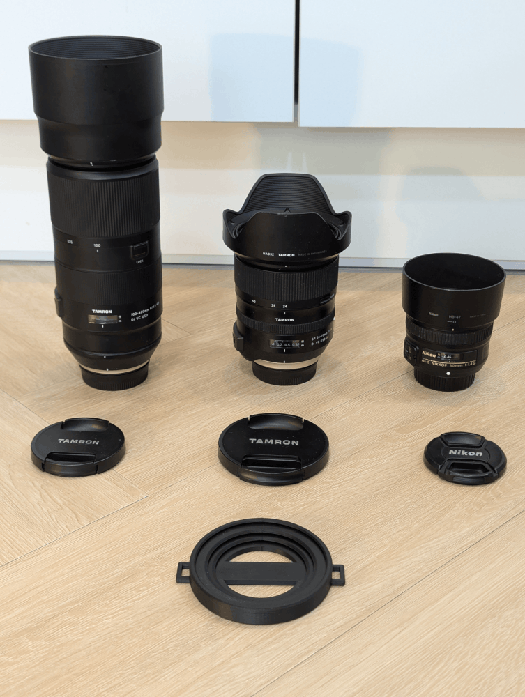

# lens-cap

This is an STL file generator for a camera lens-cap holder.

Customize the lens cap sizes you want it to hold and the strap width, then download the STL and 3D print it.

The lens cap size corresponds to your lens’s filter size.\
ex) the filter size of the Nikon AF-S NIKKOR 50mm f/1.8G is 58 mm, so its lens cap is also 58 mm.

